
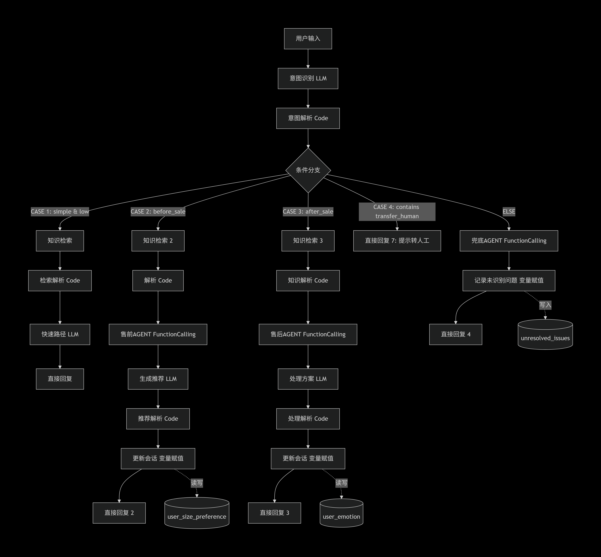

# ai-customer-service-workflow

基于 Dify 和 n8n 的智能客服多 Agent 系统。

## 📖 项目简介
本项目是一个具备高可用、防并发异常、支持无缝人机交接的自动化客服闭环系统。系统以 n8n 为高可用网关与总线，拦截外部 Webhook 触发，通过 Redis 实现分布式锁与限流，核心业务交由 Dify 智能调度中枢完成多 Agent 路由，最终通过飞书发送通知并落库。

## 🏗️ 系统架构
### 全链路架构

### n8n 网关与高可用架构

### Dify 智能调度中枢

## ✨ 核心工程化亮点
1. **并发控制与限流**：使用 Redis 分布式锁（`lock:session_id`）防止同一会话并发覆盖，利用限流器保护大模型额度。
2. **会话状态机**：Switch 节点管理 `active` 与 `handoff` 状态，一旦转人工，不再消耗 Token 调用大模型。
3. **高可用与降级策略**：Dify API 调用失败时，自动进入兜底降级策略，写入 **DLQ 死信队列**（Redis 7天过期），并安全释放分布式锁。
4. **数据持久化**：在流程末尾更新 `sessions` 表、插入 `messages` 表，实现用户画像的长期记忆。
5. **无缝人工接管**：通过 Dify 返回特定暗号 `[SYSTEM_ACTION: HANDOFF_REQUESTED]`，触发飞书交互式卡片，通知人工客服介入。

## 🛠️ 快速开始
1. 部署 Dify、n8n 和 Redis（建议使用 Docker）。
2. 将 `workflows/` 目录下的 JSON 文件导入 n8n 和 Dify。
3. 配置 n8n 的凭据（Redis、Dify API、飞书 API）。
4. 修改环境变量，启动工作流。

## 📂 目录结构
- `assets/`: 系统架构图
- `workflows/`: n8n 和 Dify 脱敏后的工作流 JSON
- `docs/`: 详细的 Prompt 设计与工具定义文档